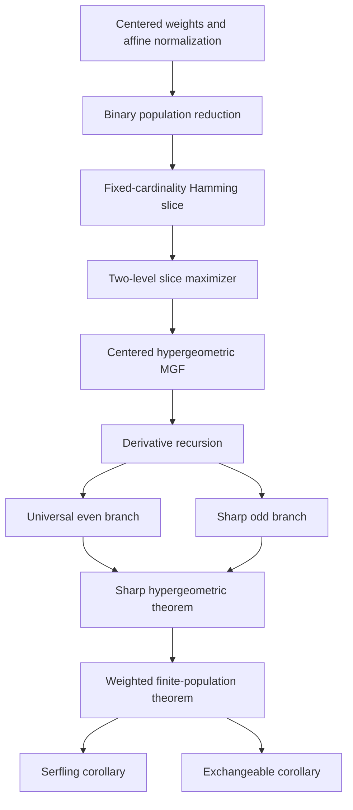

<h1 align="center">Sharp Serfling in Lean</h1>

<p align="center">
  Lean 4 formalization of <em>A Sharp Refinement of Serfling's Inequality at the Variance Scale</em>
</p>

<p align="center">
  
  <a href="https://statchan1106.github.io/sharp-serfling-lean/"></a>
  
  <a href="https://github.com/statchan1106/sharp-serfling-lean/actions/workflows/lean_action_ci.yml?query=branch%3Amain"></a>
</p>

<p align="center">
  <a href="https://statchan1106.github.io/">Seongchan Lee</a>
  &nbsp;·&nbsp;
  <a href="https://ilmunk.github.io/index.html">Ilmun Kim</a>
</p>

This repository formalizes the variance-scale refinement of Serfling's
inequality in Lean 4 and Mathlib. The development includes the weighted
finite-population MGF inequality, the optimal parity-dependent constant, the
equal-weight Serfling tails, the exchangeable transfer, the centered
hypergeometric extremal problem, and the even/odd asymptotics.

## Main result

For a fixed population \(X\in[a,b]^N\), a uniform permutation \(\pi\), and
weights \(w\in\mathbb R^n\), set

$$
T_w=\sum_{i=1}^n w_i(X_{\pi(i)}-\bar X_N),\qquad
\rho_N(w)=
\frac{N\sum_iw_i^2-(\sum_iw_i)^2}{N(N-1)}.
$$

The formalized theorem proves

$$
\log \mathbb E e^{tT_w}
\le
\frac{\kappa_N}{8}\rho_N(w)(b-a)^2t^2,
\qquad
\kappa_N=
\begin{cases}
1,&N\text{ even},\\
\displaystyle\frac{2}{N\log((N+1)/(N-1))},&N\text{ odd}.
\end{cases}
$$

The main Lean declaration is
`SharpSerfling.FinitePopulation.finitePopulation_mgf`. The corresponding
minimality theorem is
`SharpSerfling.FinitePopulation.finitePopulation_sharp_constant`.

## Formalized results

| Mathematical result | Lean declaration |
|---|---|
| Weighted finite-population MGF | `FinitePopulation.finitePopulation_mgf` |
| Smallest uniform finite-population coefficient | `FinitePopulation.finitePopulation_sharp_constant` |
| Serfling MGF and upper tail | `FinitePopulation.serfling_mgf`, `serfling_tail` |
| Lower and two-sided Serfling tails | `FinitePopulation.serfling_lower_tail`, `serfling_twoSided_tail` |
| Weighted exchangeable MGF in law | `FinitePopulation.weighted_exchangeable_mgf_centeredNorm_inLaw` |
| Smallest exchangeable coefficient | `FinitePopulation.exchangeableInLaw_Cstar_sharp_constant` |
| Sharp centered-hypergeometric MGF | `Hypergeometric.sharp_mgf` |
| Variational evaluation | `Hypergeometric.kappaStar_eq_kappa` |
| Two-level slice extremizer | `FinitePopulation.exists_twoLevel_sliceMgf_maximizer` |
| Exact first-order exchangeable asymptotic | `tendsto_nat_mul_exchangeableConstant_sub_one` |

## Proof architecture



The [proof blueprint](blueprint/) explains every arrow, and the
[declaration audit](blueprint/DECLARATIONS.md) gives a compact cross-reference.
The reader-oriented [project page](https://statchan1106.github.io/sharp-serfling-lean/)
adds a searchable declaration map.

## Build and verify

```sh
lake exe cache get
lake build
lake env lean AxiomAudit.lean
rg -n '\b(sorry|admit)\b|^\s*axiom\b|\b(unsafe|implemented_by|opaque)\b' . \
  --glob '*.lean' --glob '!**/.lake/**'
```

The build and public-theorem audit also run in GitHub Actions.

## Repository layout

| Path | Role |
|---|---|
| `SharpSerfling/` | Formal definitions, reductions, analytic estimates, and exported theorems |
| `blueprint/` | GitHub-readable proof guide and declaration audit |
| `docs/` | Reader-oriented project page deployed through GitHub Pages |
| `AxiomAudit.lean` | Kernel assumption audit for public results |
| `TRACEABILITY.md` | Detailed manuscript-to-declaration map |

## Publication links

The project page intentionally keeps the Paper and Code controls disabled before
release. To activate them, edit only `docs/assets/site-config.js` and insert the
public URLs; every page upgrades the placeholders automatically.

## Trust boundary

Project sources contain no `sorry`, `admit`, project-defined `axiom`, `unsafe`,
`implemented_by`, or `opaque` declaration. The public theorem audit reports
only the standard logical foundations inherited from Lean and Mathlib:
`propext`, `Classical.choice`, and `Quot.sound`.
