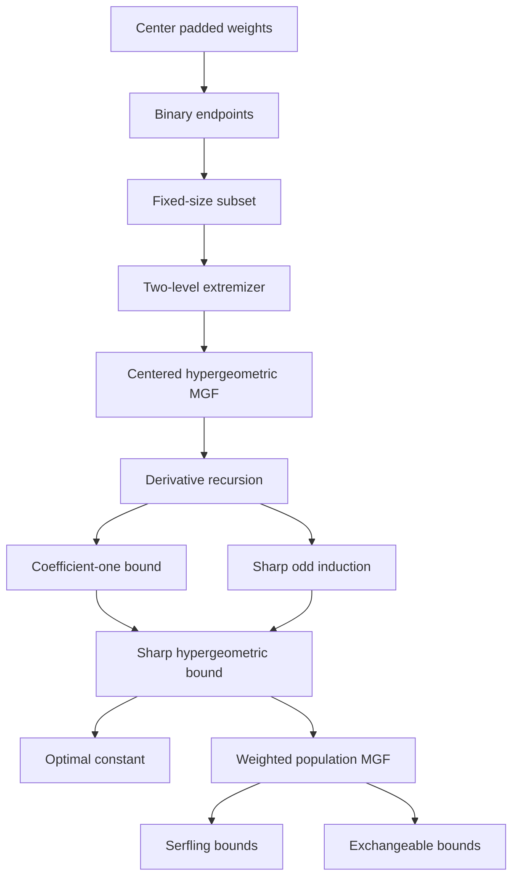

<h1 align="center">Sharp Serfling in Lean</h1>

<p align="center">
  Lean 4 formalization accompanying <em>A Sharp Variance-Scale Refinement of Serfling's Inequality</em>
</p>

<p align="center">
  <a href="https://statchan1106.github.io/sharp-serfling-lean/"></a>
  <a href="https://github.com/statchan1106/sharp-serfling-lean"></a>
</p>

<p align="center">
  <a href="https://statchan1106.github.io/">Seongchan Lee</a>
  &nbsp;·&nbsp;
  <a href="https://ilmunk.github.io/index.html">Ilmun Kim</a>
</p>

This repository is the machine-checked companion to a sharp concentration
inequality for sampling without replacement. It contains the complete Lean 4
development, a proof guide for mathematical readers, and a theorem-by-theorem
map from the paper to Lean declarations.

[MANUSCRIPT.md](MANUSCRIPT.md) records how the paper's sections and proof
boundary correspond to the formal development.

The binary-population and two-level reductions used here originate in
*A Sharper Hoeffding Bound for Weighted Sums of Exchangeable Random Variables*.
Readers interested in that earlier exchangeable setting can consult the
[paper](https://arxiv.org/abs/2608.04900) and its
[Lean project](https://github.com/statchan1106/exchangeable-hoeffding-lean).
The present project starts from those reductions and develops the sharp
variance-scale finite-population bound.

## Start here

| If you want to... | Open... |
|---|---|
| Understand the result before reading Lean | [Reader's guide](https://statchan1106.github.io/sharp-serfling-lean/) |
| Follow the mathematical proof in dependency order | [Proof guide](https://statchan1106.github.io/sharp-serfling-lean/proof.html) or [blueprint/README.md](blueprint/README.md) |
| Find the Lean theorem for a paper statement | [Lean declaration map](https://statchan1106.github.io/sharp-serfling-lean/declarations.html) or [TRACEABILITY.md](TRACEABILITY.md) |
| See the earlier exchangeable Hoeffding setting | [Exchangeable Hoeffding in Lean](https://statchan1106.github.io/exchangeable-hoeffding-lean/) |
| Check what is formalized and what the audit guarantees | [STATUS.md](STATUS.md) |
| Use the library from Lean | `import SharpSerfling` |

## Mathematical destination

Let $X=(X_1,\ldots,X_N)\in[a,b]^N$ be fixed, let $\pi$ be a
uniform random permutation, and let $w\in\mathbb R^n$. Define

$$
\begin{aligned}
T_w&=\sum_{i=1}^n w_i(X_{\pi(i)}-\bar X_N),\\
\rho_N(w)&=\frac{N\sum_iw_i^2-(\sum_iw_i)^2}{N-1}.
\end{aligned}
$$

If

$$
\sigma_N^2=\frac1N\sum_{j=1}^N(X_j-\bar X_N)^2,
$$

then the exact sampling-variance identity is

$$
\mathrm{Var}(T_w)=\rho_N(w)\sigma_N^2.
$$

The main theorem keeps this same weight-dependent scale for every real tilt:

$$
\log \mathbb E\left[e^{tT_w}\right]
\le
\frac{\kappa_N}{8}\rho_N(w)(b-a)^2t^2.
$$

Here

$$
\kappa_N=
\begin{cases}
1,&N\text{ even},\\
\displaystyle\frac{2}{N\log((N+1)/(N-1))},&N\text{ odd}.
\end{cases}
$$

The coefficient $\kappa_N$ is the smallest value depending only on $N$
that works uniformly over all bounded populations, sample sizes, signed weight
vectors, and $t\in\mathbb R$.

Headline Lean declarations:

- `SharpSerfling.FinitePopulation.finitePopulation_mgf`
- `SharpSerfling.FinitePopulation.finitePopulation_sharp_constant`
- `SharpSerfling.FinitePopulation.statistic_variance_eq_rho_mul_populationVariance`

## What is inherited, and what is new?

The paper and this repository have slightly different proof boundaries. The
first two reductions were established in the earlier
[exchangeable Hoeffding paper](https://arxiv.org/abs/2608.04900); the present
paper uses them as its starting point.

| Role in the argument | In the paper | In this repository |
|---|---|---|
| Reduce a bounded population to a binary population | Invoked from the proof of Theorem 1 in the earlier Hoeffding paper | Proved internally by `binaryRangeReduction` |
| Reduce centered fixed-norm coefficients to at most two values | Invoked from Proposition 2 in the earlier Hoeffding paper | Proved internally by `exists_twoLevel_sliceMgf_maximizer` |
| Convert the two-level problem to a centered hypergeometric MGF | Exact bridge used in Section 3 | Proved by `sliceMgf_canonicalTwoLevel` and `sliceLogMgf_le` |
| Prove the dimension-reducing MGF recursion | New argument in Section 4 | Proved by `deriv_mgf_recursion` |
| Find the sharp parity-dependent constant | New argument in Section 5 | Proved by `sharp_mgf`, `kappaStar_eq_kappa`, and `sharp_constant` |
| Transfer the result to Serfling and exchangeable bounds | Consequences of the main theorem | Proved in the `FinitePopulation` modules |

Thus the formalization is stronger than the paper at the structural
reduction step: the paper cites that step, whereas Lean checks it from first
principles inside this project.

## Proof architecture



The [proof blueprint](blueprint/README.md) explains why each arrow is needed.
The [traceability table](TRACEABILITY.md) records current paper numbers,
stable mathematical roles, and exact Lean declarations.

## Source tree by mathematical role

| Path | Mathematical role |
|---|---|
| `SharpSerfling/FinitePopulation/` | Weighted statistics, exact variance, binary and two-level reductions, main theorem, Serfling and exchangeable consequences |
| `SharpSerfling/Hypergeometric/` | Centered hypergeometric definitions, symmetries, recursion, universal and sharp bounds, variational optimality |
| `SharpSerfling/Analysis/` | Repeated-Rolle, Hermite-sign, three-coordinate, and signed-area arguments |
| `SharpSerfling/Certificates/` | Explicit polynomial and central-parameter certificates for the difficult odd case |
| `SharpSerfling/Asymptotics.lean` | Even/odd expansions and the first-order limit for the exchangeable constant |
| `blueprint/` | Mathematical dependency guide and compact declaration audit |
| `docs/` | GitHub Pages reader's guide |
| `AxiomAudit.lean`, `FullAxiomAudit.lean` | Headline and full-namespace kernel-assumption audits |

## Build and verify

The project pins Lean 4 and Mathlib at `v4.32.1`.

```sh
lake exe cache get
lake build
lake env lean AxiomAudit.lean
lake env lean FullAxiomAudit.lean
rg -n '\b(sorry|admit)\b|^\s*axiom\b|\b(unsafe|implemented_by|opaque)\b' . \
  --glob '*.lean' --glob '!**/.lake/**'
```

## Verification boundary

Project sources contain no `sorry`, `admit`, project-defined `axiom`, `unsafe`,
`implemented_by`, or `opaque` declaration. The full audit accepts only the
standard logical foundations inherited from Lean and Mathlib: `propext`,
`Classical.choice`, and `Quot.sound`.

The documentation follows the paper's current theorem and section structure;
see [MANUSCRIPT.md](MANUSCRIPT.md) for the proof-boundary overview.
